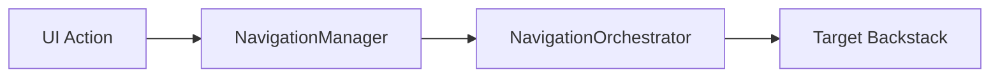

# Compose Multi-Module Navigation Architecture

A robust, type-safe, and scalable navigation architecture for Jetpack Compose based on **Navigation3**. This project demonstrates a multi-module setup designed for large-scale Android applications.

## 🚀 Key Features

- **Type-Safe Navigation**: Destinations are defined as `@Serializable` objects or data classes.
- **Hierarchical Orchestration**: Intelligent routing between Root and Nested backstacks (e.g., Main App vs. Modal Features).
- **Integrated Auth Guard**: Simple `requiresAuth` property on routes with automatic redirection to Login.
- **Event-Driven & Decoupled**: Navigate from ViewModels or Business logic without UI references using `NavigationManager`.
- **Zero-Boilerplate Data Passing**: Pass data directly through Screen constructors with automatic ViewModel initialization.
- **Large Data & Results Support**: `NavigationStore` for passing heavy models and receiving optional results without bloating routes.
- **Reflection-Optimized Deep Linking**: Fast route resolution via a centralized `RouteRegistry` that supports complex parameter parsing.
- **Common Screens Library**: Built-in support for reusable screens like `WebView` across all modules.
- **Standardized Transitions**: Pre-defined animations for Modals and Scaffolds.

---

## 🛠 Architecture Overview

### 1. Navigation Flow
The navigation follows a decoupled, event-driven pattern. Events are buffered (`replay = 1`) to ensure feature scaffolds receive the latest navigation command upon creation.



1.  **UI Action**: A user interaction or a business logic decision.
2.  **NavigationManager**: A central service that captures and broadcasts `NavigationEvent` objects.
3.  **NavigationOrchestrator**: The "Brain". It decides which backstack (Root or Nested) should handle the event based on the route hierarchy.
4.  **Target Backstack**: The specific `NavBackStack` that updates, triggering UI recomposition.

---

## 📖 Implementation Guide

### 1. Define a Screen
Screens are `NavKey` implementations. Mark destinations as protected or public.

```kotlin
@Serializable
data object HomeScreen : Screen

@Serializable
data class DetailScreen(val id: String) : Screen {
    override val showMainBottomBar = false
    override val requiresAuth = true // Default is true
}
```

### 2. Create a Navigation Graph
Graphs group related screens and manage their registration.

```kotlin
@Serializable
@Module
@InstallIn(SingletonComponent::class)
object MainGraph : Graph {
    override val route = "/main"
    override val screens = listOf(Home::class.java, Detail::class.java)

    override fun EntryProviderScope<NavKey>.registerEntries() {
        screenEntry<Home> { HomeScreen() }
        screenEntry<Detail, DetailViewModel>(
            viewModelProvide = { hiltViewModel() }
        ) { vm -> DetailScreen(vm) }
    }

    @Provides @IntoSet
    fun provideGraph(): Graph = MainGraph
}
```

### 3. Automatic ViewModel Initialization
ViewModels implementing `InitializableViewModel<S>` receive screen parameters automatically.

```kotlin
@HiltViewModel
class DetailViewModel @Inject constructor() : ViewModel(), InitializableViewModel<DetailScreen> {
    override fun init(screen: DetailScreen) {
        val id = screen.id // Data is ready to use
    }
}
```

### 4. Navigating
```kotlin
// From Composables
val navigator = LocalNavigator.current
navigator.push(DetailScreen(id = "1"))

// From ViewModels
navManager.setRoot(MainGraph)
```

---

## 🔐 Auth Handling
Routes can be protected using the `requiresAuth` property. The `NavigationOrchestrator` checks this before every navigation event and redirects to the `/auth` route if no session is found.

## 🔗 Deep Links
The `RouteRegistry` automatically maps URIs to screens. 
Example: `myapp://stories/storydetail?id=42` maps to `StoryDetail(id="42")`.
- Supports optional and default parameters.
- Supports types: `String`, `Int`, `Boolean`, `Long`.

## 🏗 Modularization Strategy
- `:core:ui`: Core navigation, Design System, and common screens.
- `:core:domain` / `:core:data`: Business logic, Repositories, and Auth state.
- `:stories`: Feature module. Exports its `Graph` via Hilt.
- `:seed`: App module. Collects all `Graph`s and defines the Root flow.
