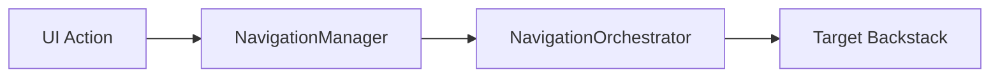

# Compose Multi-Module Navigation Architecture

A robust, type-safe, and scalable navigation architecture for Jetpack Compose based on **Navigation3**. This project demonstrates a multi-module setup designed for large-scale Android applications.

## 🚀 Key Features

- **Type-Safe Navigation**: Destinations are defined as `@Serializable` objects or data classes.
- **Multi-Module Support**: Decoupled navigation logic allowing features to be developed in isolation.
- **Orchestrated Backstacks**: Intelligent handling of multiple backstacks (e.g., Root, Main Tab Bar, Nested Scaffolds).
- **Zero-Boilerplate Data Passing**: Pass data directly through Screen constructors with automatic ViewModel initialization.
- **Reflection-Free Routing**: Fast route resolution and deep link handling via a centralized `RouteRegistry`.

---

## 🛠 Architecture Overview

### 1. Navigation Flow


### 2. Package Structure (`core:ui`)
- `navigation.model`: Core entities (`Screen`, `Graph`).
- `navigation.core`: Infrastructure (`Navigator`, `NavigationManager`, `RouteRegistry`, `NavigationEvent`).
- `navigation.orchestration`: Coordination logic (`NavigationOrchestrator`).
- `navigation.scaffold`: UI controllers and helpers (`ScaffoldController`, `BackPressHandler`).
- `navigation.utils`: Utilities (`DeepLinkHandler`, `NavigationUtils`).

---

## 📖 Implementation Guide

### 1. Define a Screen
Screens are `NavKey` implementations. Use `data object` for simple destinations and `data class` for parameterized ones.

```kotlin
@Serializable
data object HomeScreen : Screen

@Serializable
data class DetailScreen(val id: String, val title: String) : Screen {
    override val showMainBottomBar = false
}
```

### 2. Create a Navigation Graph
Graphs group related screens and manage their registration.

```kotlin
@Serializable
@Module
@InstallIn(SingletonComponent::class)
object MainGraph : Graph {
    override val route = "/main"
    
    // Explicitly list screens for performance and safety
    override val screens = listOf(Home::class.java, Detail::class.java)

    override fun EntryProviderScope<NavKey>.registerEntries() {
        screenEntry<Home> { HomeScreen() }
        
        // Automatic ViewModel initialization for parameterized screens
        screenEntry<Detail, DetailViewModel>(
            viewModelProvide = { hiltViewModel() }
        ) { vm -> DetailScreen(vm) }
    }

    @Provides @IntoSet
    fun provideGraph(): Graph = MainGraph
}
```

### 3. Automatic ViewModel Initialization
If your ViewModel implements `InitializableViewModel<S>`, it will receive the screen parameters automatically when the destination is reached.

```kotlin
@HiltViewModel
class DetailViewModel @Inject constructor() : ViewModel(), InitializableViewModel<DetailScreen> {
    override fun init(screen: DetailScreen) {
        val id = screen.id // Data is ready to use
    }
}
```

### 4. Navigating

#### From Composables
Use `LocalNavigator.current`:
```kotlin
val navigator = LocalNavigator.current
Button(onClick = { navigator.push(DetailScreen(id = "1", title = "Hello")) }) {
    Text("Go to Detail")
}
```

#### From ViewModels
Inject `NavigationManager`:
```kotlin
class MyViewModel @Inject constructor(private val navManager: NavigationManager) : ViewModel() {
    fun onComplete() = navManager.setRoot(HomeScreen)
}
```

---

## 🔗 Deep Links
The system handles deep links automatically using the `RouteRegistry`. Simply register your graph, and URLs matching `your-app://your-domain/screen-name?param=value` will be mapped to the corresponding `Screen` instance.

## 🏗 Modularization Strategy
- `:core:ui`: Common navigation components and Design System.
- `:core:domain` / `:core:data`: Business logic and persistence.
- `:feature:X`: Feature-specific modules containing their own Screens and Graphs.
- `:seed`: The "App" module that orchestrates all features.
