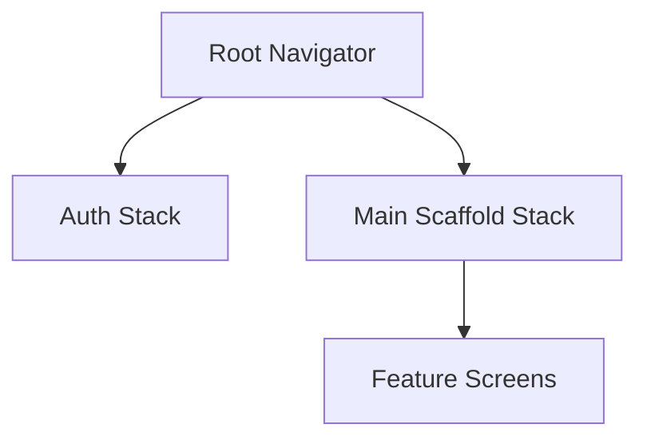

# Compose Multi-Module Navigation Architecture

A robust, type-safe, and scalable navigation architecture for Jetpack Compose based on **Navigation 3**. This project demonstrates a multi-module setup designed for large-scale Android applications with a focus on simplicity and official patterns.

## 🚀 Key Features

- **Type-Safe Navigation**: Destinations are defined as `@Serializable` objects or data classes.
- **Hierarchical Backstacks**: Supports multiple nested backstacks (e.g., Main App with internal feature stacks).
- **Decoupled Navigator**: Clean `Navigator` interface wrapping `NavBackStack` for UI-level navigation.
- **Effect-Based ViewModel Navigation**: ViewModels trigger navigation via side-effects, keeping them pure and testable.
- **Zero-Boilerplate Data Passing**: Pass data directly through Screen constructors with automatic ViewModel initialization.
- **Large Data & Results Support**: `NavigationStore` for passing heavy models and receiving optional results without bloating routes.
- **Explicit Deep Linking**: Secure and predictable route resolution via a centralized `RouteRegistry`.
- **Standardized Transitions**: Pre-defined animations for Modals and Scaffolds using Navigation 3 metadata.

---

## 🛠 Architecture Overview

### 1. Navigation Flow
The architecture uses a hierarchical approach where each Scaffold manages its own nested backstack, while a Root navigator manages the top-level flow.



1.  **Root Navigator**: Managed in `MainActivity`, handles switching between top-level flows (Auth vs. Main).
2.  **Nested Navigators**: Each scaffold (like `MainScaffold` or `StoriesScaffold`) manages its own `NavBackStack`.
3.  **LocalNavigator**: Provided via `CompositionLocal` to allow any screen to navigate within its current scope.
4.  **LocalRootNavigator**: Provided to allow nested screens to trigger top-level navigation (e.g., Logout).

---

## 📖 Implementation Guide

### 1. Define a Screen
Screens are `Route` implementations. Use `@Serializable`.

```kotlin
@Serializable
data object HomeScreen : Screen {
    override val route = "/home"
}

@Serializable
data class DetailScreen(val id: String) : Screen {
    override val route = "/detail"
    override val showMainBottomBar = false
}
```

### 2. Create a Navigation Graph
Graphs group related screens and manage their registration explicitly.

```kotlin
@Serializable
data object MainScaffoldGraph : Graph {
    override val route = "/main"

    override fun EntryProviderScope<NavKey>.registerEntries() {
        screenEntry<Home> { HomeScreen() }
        screenEntry<Detail, DetailViewModel>(
            viewModelProvide = { hiltViewModel() }
        ) { vm -> DetailScreen(vm) }
    }
}
```

### 3. Automatic ViewModel Initialization
ViewModels implementing `InitializableViewModel<S>` receive screen parameters automatically.

```kotlin
@HiltViewModel
class DetailViewModel @Inject constructor() : ViewModel(), InitializableViewModel<DetailScreen> {
    override fun init(screen: DetailScreen) {
        val id = screen.id // Data is ready to use
    }
}
```

### 4. Navigating
```kotlin
// From Composables
val navigator = LocalNavigator.current
navigator.push(DetailScreen(id = "1"))

// From nested screens to root
val rootNavigator = LocalRootNavigator.current
rootNavigator.setRoot(AuthGraph)
```

---

## 🔐 Auth Handling
Authentication state is checked at the root level in `MainActivity` to decide the initial route. Screens can also trigger navigation to Auth via effects.

## 🔗 Deep Links
The `RouteRegistry` maps URIs to screens explicitly. 
Registration is done in `MainActivity` or module initializers:
```kotlin
routeRegistry.register("/stories/detail") { uri ->
    uri.getQueryParameter("id")?.let { id ->
        StoriesScaffoldGraph.StoryDetail(id = id)
    }
}
```

## 🏗 Modularization Strategy
- `:core:navigation`: Core interfaces, Navigator, and Registry.
- `:core:ui`: Design System and common UI components.
- `:core:domain` / `:core:data`: Business logic and Repositories.
- `:feature:stories`: Feature module. Defines its own graph and internal routes.
- `:seed`: App module. Integrates all features and defines the Root flow.
